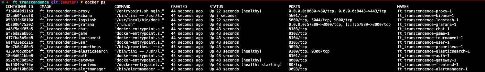
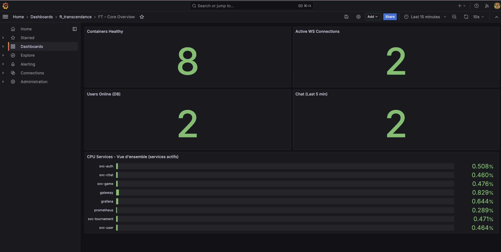
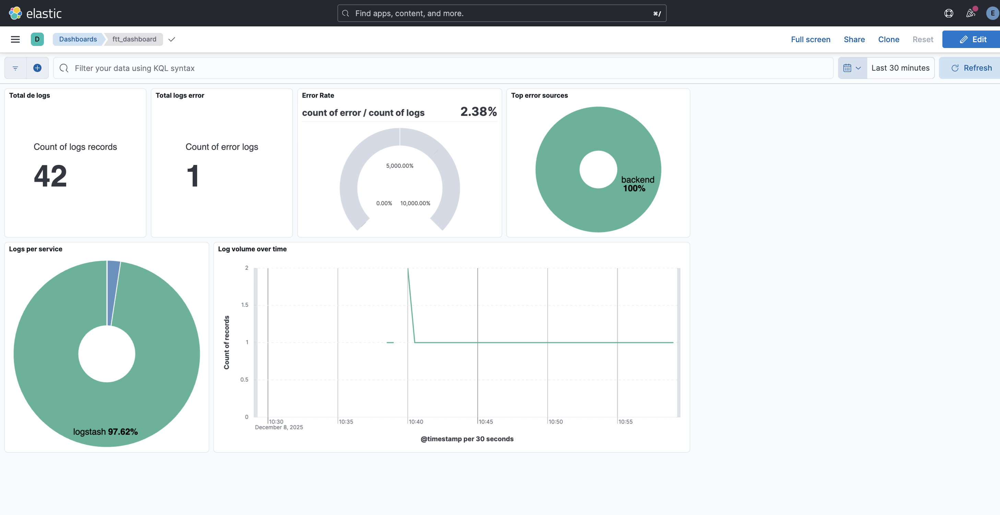
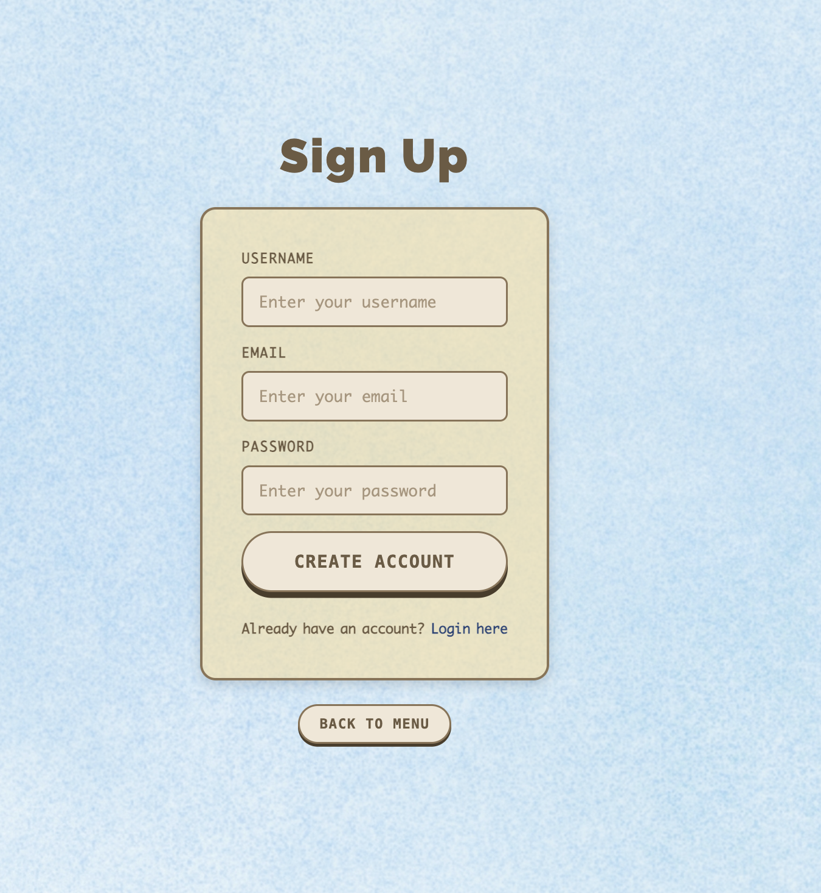
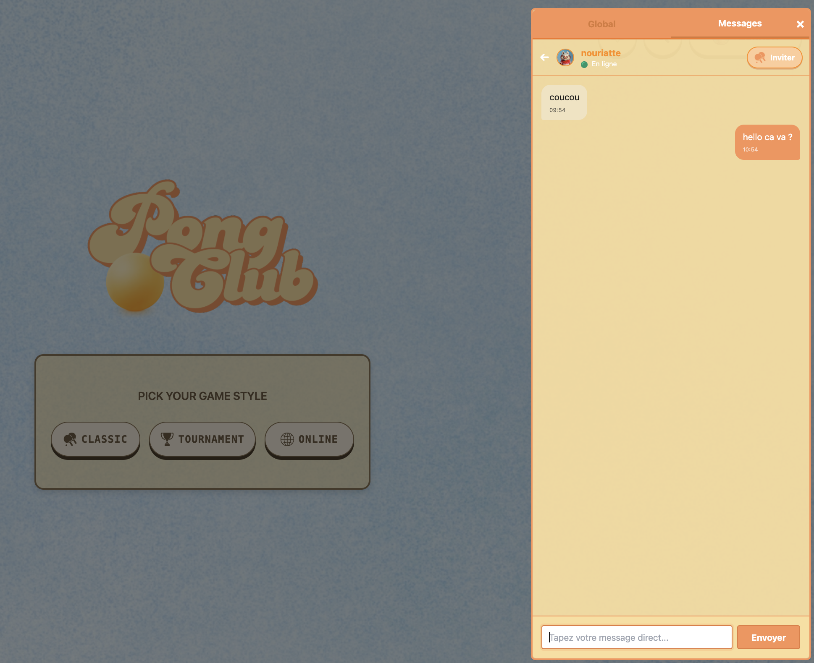

# 🎮 ft_transcendence
**Projet réalisé par** : Anais CATUSSE , Zenaba MOGNE et Lukas GOURE 

**École 42** validé à 110% en Novembre 2025

> **Projet éducatif** - Plateforme web de jeu Pong multijoueur en temps réel avec système de tournois, chat et monitoring avancé.

[](https://www.typescriptlang.org/)
[](https://www.docker.com/)
[](https://fastify.dev/)
[](https://developer.mozilla.org/en-US/docs/Web/API/WebSocket)

---

##  Table des matières

- [À propos du projet](#à-propos-du-projet)
- [Contraintes du sujet](#-contraintes-du-sujet)
- [Stack technique imposée](#-stack-technique-imposée)
- [Démarrage rapide](#-démarrage-rapide)
- [Architecture DevOps](#-architecture-devops)
- [Architecture microservices](#-architecture-microservices)
- [Monitoring & Observabilité](#-monitoring--observabilité)
- [Points d'amélioration](#-points-damélioration)
- [Captures d'écran](#-captures-décran)
- [Apprentissages clés](#-apprentissages-clés)

---


##  À propos du projet

**ft_transcendence** est le projet final du cursus 42, visant à créer une plateforme web complète de jeu Pong multijoueur avec :

-  **Jeu Pong en temps réel** : Moteur de jeu côté serveur avec synchronisation WebSocket
-  **Système de tournois** : Brackets automatiques, matchmaking, historique des parties
-  **Chat temps réel** : Messages directs (DM), chat de tournoi, gestion des bloqués
-  **Système social** : Amis, invitations de jeu, profils utilisateurs
-  **Authentification sécurisée** : JWT, bcrypt, protection XSS/SQL injection
-  **Monitoring complet** : Prometheus, Grafana, ELK Stack (13 conteneurs Docker)

Ce projet démontre une architecture **production-ready** avec séparation des responsabilités, observabilité complète et bonnes pratiques de sécurité.

---

##  Contraintes du sujet

Le projet **ft_transcendence** impose des contraintes strictes pour valider l'apprentissage :

### Contraintes obligatoires 

| Catégorie | Exigence |
|-----------|----------|
| **Jeu** | Pong multijoueur fonctionnel en temps réel |
| **Sécurité** | HTTPS/TLS obligatoire, hashage bcrypt, protection injections |
| **Framework Backend** | Utilisation d'un framework (Fastify imposé) |
| **Base de données** | Persistance des utilisateurs, parties, statistiques |
| **Frontend** | SPA (Single Page Application) sans rechargement |
| **Temps réel** | WebSocket pour le jeu et le chat |
| **Authentification** | Système d'inscription/connexion sécurisé |

### Modules supplémentaires choisis 

- ✅ **Architecture microservices** : Backend découpé en services spécialisés
- ✅ **Monitoring avancé** : Stack complète Prometheus + Grafana + ELK
- ✅ **Système de tournois** : Brackets automatiques avec gestion des rounds
- ✅ **Chat avancé** : DM, bloquage utilisateurs, historique persistant

---

##  Stack technique imposée

### Frontend (obligatoire TypeScript)

- **TypeScript** : Langage imposé pour le typage statique
- **Vanilla TS** : SPA pure sans framework React/Vue/Angular (choix pédagogique)
- **TailwindCSS** : Framework CSS utilitaire pour le design rapide
- **WebSocket API native** : Communication temps réel avec le backend
- **Canvas API** : Rendu graphique du jeu Pong

### Backend (Node.js + TypeScript)

- **Node.js 20+** : Runtime JavaScript serveur
- **TypeScript** : Cohérence avec le frontend + typage
- **Fastify** : Framework web haute performance (alternative Express)
- **SQLite** : Base de données légère sans serveur externe
- **WebSocket (ws)** : Gestion des connexions temps réel
- **bcryptjs** : Hashage sécurisé des mots de passe
- **jsonwebtoken** : Authentification JWT stateless

### Infrastructure & DevOps

- **Docker + Docker Compose** : Conteneurisation obligatoire
- **Nginx** : Reverse proxy + terminaison SSL/TLS
- **Prometheus** : Collecte de métriques système et applicatives
- **Grafana** : Visualisation des métriques et dashboards
- **ELK Stack** : Centralisation et analyse des logs
  - Elasticsearch : Moteur de recherche et stockage
  - Logstash : Pipeline de traitement des logs
  - Kibana : Interface d'exploration des logs

---

##  Démarrage rapide

### Prérequis

- Docker Engine 20.10+
- Docker Compose 2.0+
- 4 GB RAM minimum (recommandé : 8 GB pour ELK)
- Ports disponibles : 8080, 8443

### Installation

1. **Cloner le dépôt**
```bash
git clone https://github.com/votre-username/ft_transcendence.git
cd ft_transcendence
```

2. **Créer le fichier `.env`** (à la racine du projet)

```bash
# ===========================================
# CONFIGURATION FT_TRANSCENDENCE
# ===========================================

# ----- Application -----
PUBLIC_HOST=localhost
FRONT_ORIGINS=https://localhost:8443
NODE_ENV=production

# ----- Sécurité -----
# ⚠️  CHANGEZ CES VALEURS EN PRODUCTION !
JWT_SECRET=your-super-secret-jwt-key-change-me-in-production-min-32-chars
BCRYPT_ROUNDS=10

# ----- Base de données -----
DB_PATH=/data/app.sqlite
ENABLE_SQLITE_METRICS=true
USERS_ONLINE_WINDOW_MIN=5

# ----- ELK Stack -----
ELASTIC_PASSWORD=elastic
ELASTIC_USERNAME=elastic
KIBANA_SYSTEM_PASSWORD=kibana

# ----- Grafana -----
GF_SECURITY_ADMIN_USER=admin
GF_SECURITY_ADMIN_PASSWORD=admin123!
GF_SERVER_ROOT_URL=https://localhost:8443/grafana/
GF_SERVER_SERVE_FROM_SUB_PATH=true
```

>  **Note de sécurité** : Ces valeurs sont des exemples pour l'environnement de développement. 
> En production, utilisez des secrets générés aléatoirement (ex: `openssl rand -hex 32`).

3. **Lancer l'infrastructure complète**

```bash
make up
# Ou manuellement : docker compose up -d --build
```

4. **Attendre l'initialisation** (~2 minutes pour ELK)

Surveillez les logs :
```bash
make logs
# Ou : docker compose logs -f
```

5. **Accéder à l'application**

| Service | URL | Identifiants |
|---------|-----|--------------|
| ** Application** | https://localhost:8443 | Créer un compte |
| ** Grafana** | https://localhost:8443/grafana/ | admin / admin123! |
| ** Kibana** | https://localhost:8443/kibana/ | elastic / elastic |
| ** Prometheus** | https://localhost:8443/prometheus/ | - |
| ** Alertmanager** | https://localhost:8443/alertmanager/ | - |

>  **Certificat SSL** : Le certificat est auto-signé. Acceptez l'exception de sécurité dans votre navigateur.

### Commandes utiles

```bash
make up        # Démarrer tous les services
make down      # Arrêter tous les services
make restart   # Redémarrer complètement (nettoyage + rebuild)
make logs      # Afficher les logs en temps réel
make clean     # Arrêter et supprimer les volumes ( perte de données)
```

*Containers*
---

##  Architecture DevOps

### Vue d'ensemble : 13 conteneurs Docker

L'architecture repose sur **13 conteneurs Docker orchestrés** par Docker Compose, organisés en 5 couches logiques :

```
┌─────────────────────────────────────────────────────────────────────┐
│                       COUCHE PRÉSENTATION                           │
│  ┌──────────────┐        ┌──────────────────────────────┐           │
│  │   Browser    │◄──HTTPS──►│   Nginx Proxy (TLS)      │            │
│  └──────────────┘        └──────────────────────────────┘           │
└─────────────────────────────────────────────────────────────────────┘
                                    │
┌─────────────────────────────────────────────────────────────────────┐
│                      COUCHE APPLICATION                             │
│                                                                     │
│  ┌─────────────────────┐      ┌─────────────────────────┐           │
│  │   Frontend SPA      │      │   Gateway (API)         │           │
│  │  TypeScript + Vite  │      │   Fastify + SQLite      │           │
│  └─────────────────────┘      └─────────────────────────┘           │
└─────────────────────────────────────────────────────────────────────┘
                                    │
┌─────────────────────────────────────────────────────────────────────┐
│                   COUCHE MICROSERVICES (Backend)                    │
│                                                                     │
│  ┌──────────┐  ┌──────────┐  ┌──────────┐  ┌──────────┐             │
│  │   Auth   │  │   Game   │  │   Chat   │  │Tournament│             │
│  │  :8101   │  │  :8102   │  │  :8103   │  │  :8104   │             │
│  └──────────┘  └──────────┘  └──────────┘  └──────────┘             │
│       └─────────────┬───────────────────────────┘                   │
│  ┌──────────┐       │                                               │
│  │   User   │       │   Tous communiquent avec le Gateway           │
│  │  :8105   │◄──────┘   pour accéder à la base SQLite               │
│  └──────────┘                                                       │
└─────────────────────────────────────────────────────────────────────┘
                                    │
┌─────────────────────────────────────────────────────────────────────┐
│                     COUCHE MONITORING (Métriques)                   │
│                                                                     │
│  ┌────────────────┐   ┌────────────────┐   ┌──────────────────┐     │
│  │  Prometheus    │──►│    Grafana     │   │  Alertmanager    │     │
│  │  (collecte)    │   │  (dashboards)  │   │   (alertes)      │     │
│  └────────────────┘   └────────────────┘   └──────────────────┘     │
│         ▲                                                           │
│         └──── Scrape /metrics depuis tous les services              │
└─────────────────────────────────────────────────────────────────────┘
                                    │
┌─────────────────────────────────────────────────────────────────────┐
│                      COUCHE LOGS (ELK Stack)                        │
│                                                                     │
│  ┌─────────────┐     ┌─────────────┐     ┌─────────────┐            │
│  │  Logstash   │────►│Elasticsearch│◄────│   Kibana    │            │
│  │  (pipeline) │     │  (stockage) │     │ (interface) │            │
│  └─────────────┘     └─────────────┘     └─────────────┘            │
│         ▲                                                           │
│         └──── Collecte logs stdout/stderr Docker                    │
└─────────────────────────────────────────────────────────────────────┘
```

### Schéma détaillé de l'infrastructure


---

L'infrastructure est **automatisée** via deux outils clés :

- Makefile : Orchestration des commandes
- Docker Compose : Orchestration des conteneurs

**13 conteneurs gérés via `docker-compose.yml` = Déploiement en < 2 min ** :

```bash
$ make up
[+] Building 45.2s (12/12) FINISHED          # Build images
[+] Running 13/13                            # Démarre conteneurs
✅ Gateway ready on port 8000
✅ Frontend ready on https://localhost:8443
✅ ELK initializing...
✅ Prometheus scraping metrics
✅ Ready for traffic!
```


## 🔬 Architecture microservices

### Pourquoi les microservices ?

Le choix d'une architecture microservices (au lieu d'un monolithe) répond à plusieurs objectifs pédagogiques et techniques :

#### ✅ Avantages

1. **Séparation des responsabilités** : Chaque service a un rôle unique et bien défini
2. **Scalabilité** : Possibilité de scaler indépendamment les services (ex: plus d'instances `game` en cas de charge)
3. **Maintenance** : Isolation des bugs (un crash du service `chat` n'affecte pas `game`)
4. **Déploiement indépendant** : Mise à jour d'un service sans tout redéployer
5. **Apprentissage** : Compréhension des architectures distribuées modernes

#### ⚠️ Inconvénients (contexte éducatif)

- **Complexité accrue** : Plus de conteneurs à gérer
- **Latence réseau** : Communication inter-services HTTP (vs appels de fonctions)
- **Débogage** : Nécessité de tracer les requêtes (X-Request-ID)
- **Surcharge** : Overhead pour un petit projet (acceptable en apprentissage)

### Comment ça fonctionne : Pattern "Gateway + Services"

```typescript
// backend/src/index.ts - Logique de routage par SERVICE_ROLE

const ROLE = process.env.SERVICE_ROLE || "gateway";

if (ROLE === "gateway") {
  // Gateway : API principale + WebSocket + accès SQLite
  initDb(); // Initialise la base de données
  
  // Routes publiques
  app.post("/api/login", loginHandler);
  app.post("/api/signup", signupHandler);
  
  // Routes protégées (JWT)
  app.get("/api/users/me", { preHandler: authMiddleware }, getUserProfile);
  
  // WebSocket temps réel
  registerRawWs(app); // Gestion jeu + chat
  
} else if (ROLE === "svc-auth") {
  // Service Auth : Validation tokens, permissions
  app.post("/internal/auth/validate", validateTokenHandler);
  
} else if (ROLE === "svc-game") {
  // Service Game : Logique métier du jeu Pong
  app.post("/internal/game/validate", validateMoveHandler);
  
} // ... autres services
```

### Communication inter-services

```
┌─────────────────────────────────────────────────────────────┐
│  Client fait : POST /api/users/profile                      │
│         │                                                   │
│         ▼                                                   │
│  1. Nginx Proxy (HTTPS→HTTP)                                │
│         │                                                   │
│         ▼                                                   │
│  2. Gateway reçoit la requête                               │
│         │                                                   │
│         ├──► Middleware JWT : vérifie le token              │
│         │                                                   │
│         ├──► Appel HTTP interne : http://user:8105/internal │
│         │    (Service User traite la logique métier)        │
│         │                                                   │
│         ├──► Service User accède à SQLite via Gateway       │
│         │    (appel HTTP de retour si nécessaire)           │
│         │                                                   │
│         ▼                                                   │
│  3. Réponse JSON renvoyée au client                         │
└─────────────────────────────────────────────────────────────┘
```


### Exemple concret : Création d'une partie

```typescript
// 1. Client envoie : POST /api/games/create
//    Gateway reçoit la requête

// 2. Gateway vérifie l'authentification (JWT)
const userId = request.user.id;

// 3. Gateway appelle le service Game pour validation
const response = await fetch('http://game:8102/internal/game/validate', {
  method: 'POST',
  headers: { 'Content-Type': 'application/json' },
  body: JSON.stringify({ userId, gameMode: 'classic' })
});

// 4. Service Game répond si les règles métier sont OK
if (!response.ok) {
  return reply.status(400).send({ error: 'Invalid game setup' });
}

// 5. Gateway insère en base (SQLite accessible uniquement par Gateway)
const gameId = await GameService.createGame({
  player1_id: userId,
  status: 'waiting'
});

// 6. Retour au client
return reply.send({ gameId, status: 'created' });
```

---

## 📊 Monitoring & Observabilité

### Stack complète : Prometheus + Grafana + ELK

#### 1. Métriques Prometheus (temps réel)

**Métriques exposées par chaque service** :
- `http_request_duration_seconds` : Latence des requêtes API
- `http_request_total` : Nombre de requêtes par endpoint et status code
- `websocket_connections_total` : Connexions WebSocket actives
- `sqlite_query_duration_seconds` : Performance base de données
- `active_games` : Parties Pong en cours
- `users_online` : Utilisateurs connectés dans les 5 dernières minutes


#### 2. Dashboards Grafana


*Monitoring des performances et métriques métier en temps réel* 

Un dashboard personnalisé `ft-transcendence-dashboard-core.json` affiche :

- **Performance API** : Latence P50/P95/P99, throughput
- **Santé des services** : Status codes, erreurs, availability
- **Métriques métier** : Parties actives, messages chat/min, utilisateurs en ligne
- **Système** : CPU, RAM, réseau des conteneurs Docker

#### 3. Logs centralisés ELK

*Exploration et recherche dans les logs centralisés*

**Pipeline Logstash** :
```
Docker containers (stdout/stderr)
    │
    ├──► Logstash (parsing + enrichissement)
    │         │
    │         └──► Elasticsearch (indexation)
    │                     │
    │                     └──► Kibana (recherche + visualisation)
```

**Dashboards Kibana** :

1. **Dashboard `ftt_dashboard`** : Analyse des logs applicatifs
   - Total de logs (métrique : nombre total)
   - Total logs error (métrique : nombre d'erreurs)
   - Error Rate (jauge : pourcentage erreurs / total logs)
   - Top error sources (donut : services avec le plus d'erreurs)
   - Logs per service (donut : distribution logs par service)
   - Log volume over time (ligne : tendance temporelle)

#### 4. Alertes Alertmanager

Configurées dans `monitoring/prometheus/rules.yml` :

```yaml
- alert: ServiceDown
  expr: up == 0
  for: 30s
  annotations:
    summary: "Service {{ $labels.job }} est down"

- alert: HighErrorRate
  expr: rate(http_request_total{status=~"5.."}[5m]) > 0.05
  annotations:
    summary: "Taux d'erreurs 5xx élevé (>5%)"
```

### Pourquoi ce monitoring ?

- **Débogage rapide** : Identifier immédiatement quel service pose problème
- **Performance** : Détecter les goulots d'étranglement (requêtes lentes, memory leaks)
- **Apprentissage** : Comprendre les outils utilisés en production (FAANG, startups)
- **Démo projet** : Impressionner les recruteurs avec une stack complète

---

##  Points d'amélioration

Ce projet est **fonctionnel et complet**, mais des améliorations sont possibles pour une vraie mise en production :

### 1. Architecture microservices

#### ❌ Problème actuel
- **Dockerfile unique partagé** : Tous les microservices utilisent le même Dockerfile (`backend/Dockerfile`)
- **Code monolithique** : Tout le code backend est dans le même dépôt, différencié uniquement par `SERVICE_ROLE`

#### ✅ Solution idéale
```
backend/
├── services/
│   ├── auth/
│   │   ├── Dockerfile          # Dockerfile dédié
│   │   ├── package.json        # Dépendances spécifiques
│   │   └── src/
│   ├── game/
│   │   ├── Dockerfile
│   │   ├── package.json
│   │   └── src/
│   └── ... (autres services)
```

**Avantages** :
- Images Docker plus légères (pas de code inutile)
- Déploiement vraiment indépendant
- Dépendances isolées (ex: `game` pourrait utiliser une lib de physique spécifique)

### 2. Base de données

#### ❌ Problème actuel
- **SQLite monolithique** : Une seule base pour tout, accessible uniquement via Gateway
- **Pas de séparation des données** : Users, games, tournaments dans la même DB

#### ✅ Solution idéale
- **PostgreSQL ou MySQL** : Base multi-connexions
- **Base par service** (pattern Database-per-Service) :
  - `auth-db` : Utilisateurs, sessions
  - `game-db` : Parties, statistiques
  - `chat-db` : Messages, conversations
- **Accès direct** : Chaque service gère sa propre base

### 3. Logging

#### ❌ Problème actuel
- **console.log() partout** : ~100+ logs de debug dans le code
- **Pas de niveaux de logs** : Impossible de filtrer (debug/info/error)


### 4. Tests

#### ❌ Manque actuel
- Tests manuels uniquement (`scripts/testeur.sh`)
- Pas de tests unitaires
- Pas de tests d'intégration automatisés


### 5. CI/CD

#### ❌ Manque actuel
- Déploiement manuel uniquement
- Pas de validation automatique avant merge

#### ✅ Solution idéale
```yaml
# .github/workflows/ci.yml
name: CI
on: [push, pull_request]

jobs:
  test:
    runs-on: ubuntu-latest
    steps:
      - uses: actions/checkout@v3
      - name: Build images
        run: docker compose build
      - name: Run tests
        run: docker compose run --rm backend npm test
      - name: Security scan
        run: docker scan backend:latest
```


---

## 📸 Captures d'écran
###  Authentification


*Interface de connexion et inscription sécurisée*

###  Profil utilisateur


*Statistiques, historique des parties et amis*

###  Interface de jeu


*Partie de Pong en temps réel avec synchronisation WebSocket*

###  Système de tournois


*Brackets automatiques et suivi des matchs*

###  Chat temps réel


*Messages directs et chat de tournoi*


---

##  Apprentissages clés

Ce projet m'a permis d'acquérir des compétences sur :

- **Architecture distribuée** : Conception et communication inter-services
- **WebSocket** : Gestion temps réel (connexions, déconnexions, état)
- **Sécurité web** : JWT, bcrypt, protection XSS/SQL injection, HTTPS/TLS
- **Observabilité** : Métriques (Prometheus), logs (ELK), alerting (Alertmanager)
- **DevOps** : Docker multi-stage, orchestration Compose, reverse proxy Nginx
- **TypeScript full-stack** : Cohérence backend/frontend avec typage statique
- **Game engine** : Physique 2D, collision detection, synchronisation réseau


